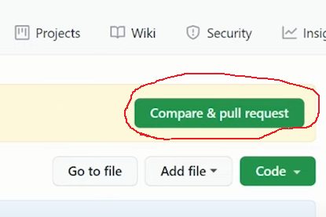
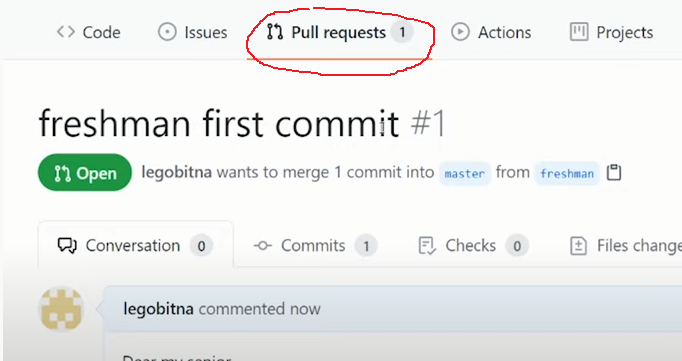

# 협업
- [회사에서 개발자들은 어떻게 일할까? 회사에서 쓰는 실전 깃 깃허브 한방에 끝내기! 15분만 투자해라 님들의 회사생활이 편해짐](https://www.youtube.com/watch?v=cwC8t9dno2s)

## 마스터가 아닐 경우 협업 
1. 작업
2. 커밋
3. 브랜치 생성
```
git checkout -b freshman
```
freshman 를 생성하고 체크아웃까지 실행
4. push
```
git push orign freshman
```   
5. ```Compare & pull request``` 버튼을 누르고 커맨트를 입력한다.   
   
    
6.  ```Pull request ``` 가 생긴다.   
  
7. master 가 ```Merge pull request``` 버튼을 눌러 최종 결과물을 만든다.

## 다른 사람이 작업한 결과물을 합칠때
1. commit
2. git pull origin master
