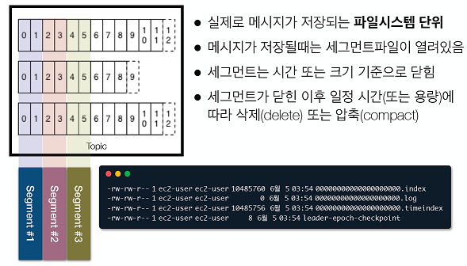
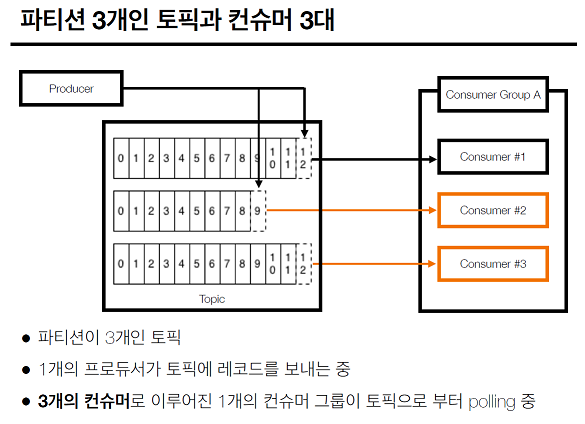
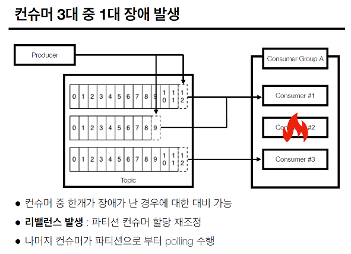
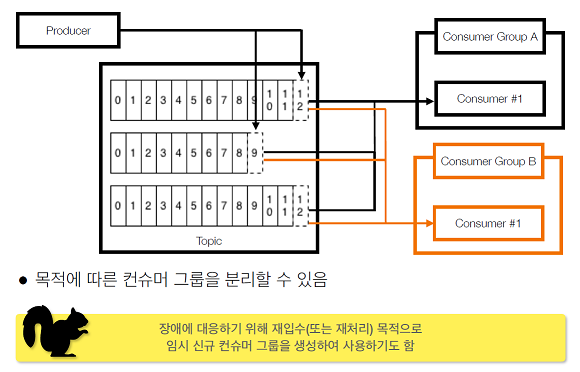
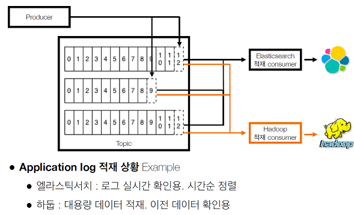
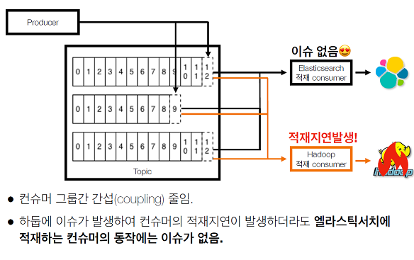

# 2021.12.01 kafka

## broker :    
카프카 애플리케이션 서버 단위
## record
## topic & partition   
topic : 데이터 분리 단위   
partition : 레코드를 담고 있음. 컨슈머 요청시 레코드 전달    
offset : 각 레코드당 파티션에 할당된 고유 번호   
## producer & consumer 
producer : 레코드를 생성하여 브로커로 전송하는 어플리케이션     
consumer : 레코드를 폴링하는 어플리케이션   
consumer group :  다수 컨슈머 묶음   
consumer offset :  특정 컨슈머가 가져가 레코드의 번호   
## kafka log and segment 
- 실제로 메세지가 저장되는곳은 파일시스템

## 실제로 토픽이랑 파티션에 데이터가 들어가고 프로듀서와 컨슈머가 어떻게 돌아가는지 

- 파티션 3개인 토픽과 컨슈머 1대

- 파티션 3개인 토픽과 컨슈머 3대
각 파티션에 컨슈머가 프로세스나 쓰레드등으로 할당되었다면 병렬처리가 되므로 속도의 향상을 가져올수 있다.    

- 파티션 3개인 토픽과 컨슈머 4대
컨슈머가 한개 남으므로 컨슈머 낭비    
==> 컨슈머의 갯수는 항상 파티션의 갯수보다 같거나 적어야 한다.

## 파티션 3대중 1대 장애발생   
 리밸런스 발생 : 파티션 컨슈머 할당 재조정   
 라밸런스시 멈춤 발생. 리밸런스 리스너 사용

## 2개 이상의 컨슈머 그룹

## 어플리케이션 로그 적재용 컨슈머 그룹 2개

## 컨슈머 그룹 장애에 격리되는 다른 컨슈머 그룹

## broker partition replication :   
broker  이슈에 대응하기 위해서 파티션을 다른 브로커에 복제하여 이슈 대응함

## broker partition replication 설정 in kafka-topics   
고 가용성을 위한 파티션 복제기능으로 데이터 유실 방지

## 리더 파티션, 팔로워 파티션   
리더 : 기존에 사용되던 파티션, 클라이언트와 데이터를 주고 받는 역활   
팔로워 : 복제된 파티션, 리더 파티션으로부터 지속적으로 레코드를 복제   
만약 리더파티션의 동작이 불가능 할 경우, 나머지 팔로워 중 1개가 리더로 선출됨   

## ISR, 리더와 팔로워의 싱크
특정 파티션의 리더, 팔로워가 레코드가 모드 복제되어 있어  sync  가 맞는 상태   
ISR(In-Sync Replica)
ISR 이 아닌 상태에서 장애가 난다면 :  unclean.leader.election.enable   
기본으로 false 로 설정되어 있음   
false : 싱크 될때까지 기다림   
true : 데이터 유실이 되더라도 처리가 중요하므로 일단 처리함

##  kafka rack-awareness : 
1 개의 Rack 에 다수의 브로커를 몰아넣는 것은 위험

## 왜 카프카 클러스터는 장애에 대응한 로직이 많나요?

## kafka client
Kafka와 데이터를 주고받기 위해 사용하는 Java Library   
https://mvnrepository.com/artifact/org.apache.kafka/kafka-clients   
Producer, Consumer, Admin, Stream 등 Kafka관련 api 제공

### kafka streams
• 데이터를 변환(Transformation)하기 위한 목적으로 사용하는 API   
• 스트림 프로세싱을 지원하기 위한 다양한 기능을 제공   
• Stateful 또는 Stateless 와 같이 상태기반 스트림 처리 가능   
• Stream api와 DSL(Domain Specific Language)를 동시 지원   
• Exactly-once 처리, 고 가용성 특징   
• Kafka security(acl, sasl 등) 완벽 지원   
• 스트림 처리를 위한 별도 클러스터(ex. yarn 등) 불필요   

### kafka connect
• 많은 경우 Kafka client로 Kafka로 데이터를 넣는 코드를 작성할때도 있지만,
Kafka connect를 통해 data를 Import/Export 할 수 있음.    
• 코드 없이 configuration으로 데이터를 이동시키는 것이 목적    

### kafka Mirror maker   
특정 카프카 클러스터에서 다른 카프카 클러스터로 Topic 및 Record를 복제
하는 Standalone tool

### 그 외 Kafka 생태계를 지탱하는 application들

데이터가 갑자기 많아지더라도 확장이 용이한 시스템이 필요해서 생겨남
  
zookeeper 와 연동이 필요함

- 컨슈머 그룹이 1개 있을때
- 컨슈머 그룹이 2개 이상 있을때 : 목적에 따라 나눌 수 있음
