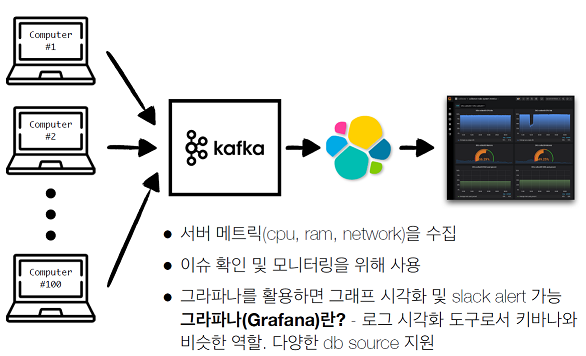

# 2021.12.01 Apache kafka 파이프라인 실습

- 텔레그래프 설치   
telegraf : 데이터 수집   
[telegraf](https://github.com/influxdata/telegraf)
    
   
- cpu, memory 를 telegraf 로 수집해서 kafka 로 보내는 실습. 파일 단위로 적재하는 실습 


- 28번 커맨드
카프카 토픽 만드리
```bash
./kafka-topics.sh --create --bootstrap-server {aws ec2 public ip}:9092 --replication-factor 1 --partitions 5 --topic my-computer-metric
```