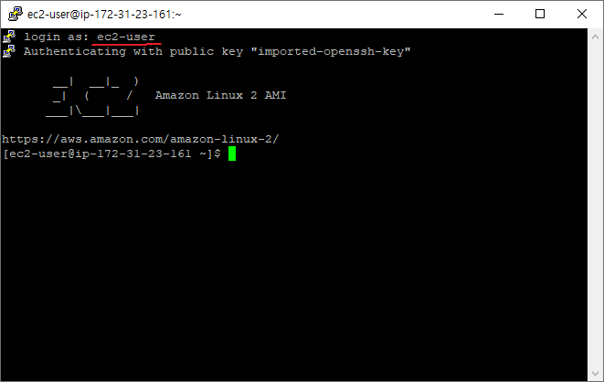

#

jjuntang@naver.com   
AWS 계정 이름 : smf-aws   
키 페어 이름 : smf-kafka   


[[PuTTY]private key(ppk,pem)를 이용하여 ssh접근하기](https://kamang-it.tistory.com/205)

--- 
```
자바 버전 확인
java -version

jvm 인스톨
sudo yum install -y java-1.8.0-openjdk-devel.x86_64

카프카 다운받기 : 사이트에 접속하여 각 버전에 맞게 다운 로드
wget https://downloads.apache.org/kafka/2.7.2/kafka_2.12-2.7.2.tgz

힙설정 변경
export KAFKA_HEAP_OPTS="-Xmx400m -Xms400m"
echo $KAFKA_HEAP_OPTS

server.properties 수정


./bin/zookeeper-server-start.sh -daemon config/zookeeper.properties
```