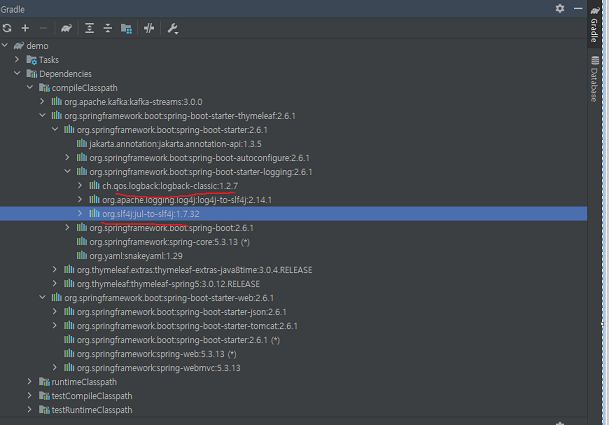

# 2021.12.01  섹션 1. 프로젝트 환경설정

## 프로젝트 생성 
스프링 부트 스타터 사이트로 이동해서 스프링 프로젝트 생성   
https://start.spring.io

- dependancy :   
spring web   
thymeleaf   

- build.gradle   
라이브러리를 다운받는 곳
```gradle
repositories {
    mavenCentral()
}
```
gradlew   
gradlew.bat   
settings.gradle   

- 프로젝트 빌드 후 실행   
run  창의 console 메세지
```
2021-12-02 15:21:30.303  INFO 5260 --- [           main] o.s.b.w.embedded.tomcat.TomcatWebServer  : Tomcat started on port(s): 8080 (http) with context path ''
```

- 테스트   
localhost:8080

```java
SpringApplication.run(DemoApplication.class, args);
```
톰캣서버를 띄우면서 스프링부트 실행됨

## 라이브러리 살펴보기
- External Libraries 
- gradle 은 의존관계를 관리해 준다
- 실무에서는 로그를 써야한다.   
logback   
slf4j   

- 테스트 
```
junit: 테스트 프레임워크
mockito: 목 라이브러리
assertj: 테스트 코드를 좀 더 편하게 작성하게 도와주는 라이브러리
spring-test: 스프링 통합 테스트 지원
```

## View 환경설정
- welcome page 만들기
- static 에 index.htm 을 만들고 localhost:8080 접속
- 필요한것 찾기   
1. https://spring.io/ 에 접속
2. projects -> spring boot -> learn -> 	Reference Doc.

- thymeleaf 템플릿 엔진를 이용하여 동적인 페이지 만들기  
1. 진입점인 컨트롤러를 만든다. 
```  
컨트롤러 패키지 만듬.   
클래스 만듬
@Controller    
@GetMapping   
spring-boot-devtools : 컴파일 없이 html 재 시작 가능
```

```java
@Controller
public class HelloController {

    @GetMapping("hello")
    public String hello(Model model) {
        model.addAttribute("data", "hello");
        return "hello";
    }
}

```

## 빌드하고 실행하기
- 빌드해서 실행파일 만들기   
윈도우에서    
```
./gradlew.bat build
cd build/libs
java -jar demo1-0.0.1-SNAPSHOT.jar
```

```
./gradlew.bat clean
```