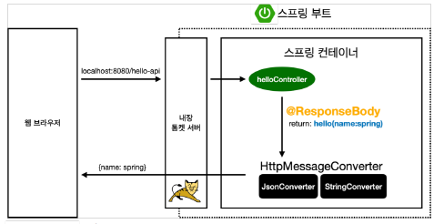

# 2021.12.01 섹션 2. 스프링 웹 개발 기초


## 정적 컨텐츠
- 스프링은 정적 컨텐츠를 static 폴더에서 찾는다.

## MVC와 템플릿 엔진
- model, view, controller 
- view : 화면만 그리는데 집중

- 테스트 : 아래와 같이 name 에 값을 넣어 전달
```
http://localhost:8080/hello-mvc?name=spring
```

```java
@GetMapping("hello-mvc")
public String helloMvc(@RequestParam("name") String name, Model model) {
    model.addAttribute("name", name);
    return "hello-template";
}
```


## API   
- 데이터를 바로 클라이언트로 보냄
- 클라이언트가 안드로이드나 아이폰일때 json 형태의 데이터 사용
- 서버끼리 통신할때

- 테스트1 : api 로 받기,  html 이 아니라 문자그대로 전달
```
http://localhost:8080/hello-string?name=spring
```
```java
@GetMapping("hello-string")
@ResponseBody
public String helloString(@RequestParam("name") String name, Model model) {
    return "hello " + name;
}
```

- 테스트2 : json 으로 받기   
객체를 리턴하면 json 으로 넘어감
```
http://localhost:8080/hello-api?name=spring
```
===>
```
{"name":"spring"}
```

```java
static class Hello {
    private String name;

    public String getName() {
        return name;
    }

    public void setName(String name) {
        this.name = name;
    }
}
```
```java
@GetMapping("hello-api")
@ResponseBody
public Hello helloApi(@RequestParam("name") String name, Model model) {
    Hello hello = new Hello();
    hello.setName(name);
    return hello;
}
```
   
jacson : 객체를 json 으로 바꾸어주는 대표적인 라이브러리 중 하나