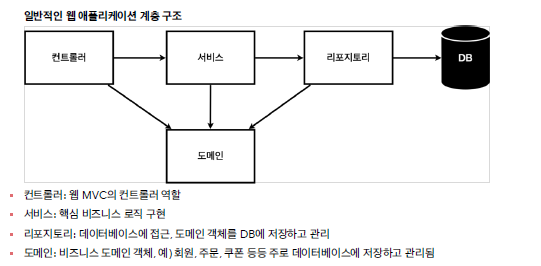
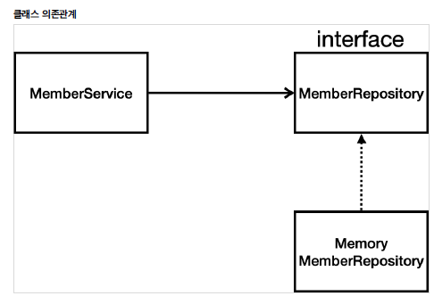

# 2021.12.02 섹션 3. 회원 관리 예제 - 백엔드 개발

## 비즈니스 요구사항 정리
```
데이터: 회원ID, 이름
기능: 회원 등록, 조회
아직 데이터 저장소가 선정되지 않음(가상의 시나리오)
계층구조
클래스 의존관계
```


실제 업무할때 어떤것을 도메인으로 정의해야 하는가??
  


```
아직 데이터 저장소가 선정되지 않아서, 우선 인터페이스로 구현 클래스를 변경할 수 있도록 설계
데이터 저장소는 RDB, NoSQL 등등 다양한 저장소를 고민중인 상황으로 가정
개발을 진행하기 위해서 초기 개발 단계에서는 구현체로 가벼운 메모리 기반의 데이터 저장소 사용
```

## 회원 도메인과 리포지토리 만들기
리포지토리 객체: 도메인 객체를 저장하고 불러올수 있는 저장소

### 코딩
1. domain package   
Member class
2. repository package   
MemberRepository interface   
MemoryMemberRepository class 

## 회원 리포지토리 테스트 케이스 작성
- junit  사용
- MemoryMemberRepository 의 각 메서드 테스트
```
save
findById
findByName
findAll
```

```java
import org.junit.jupiter.api.Test;
```

실무에선 빌드툴이랑 엮어 테스트를 통과하지 않으면 배포되지 않도록한다.

## 회원 서비스 개발
회원 서비스 : 실제 비지니스 로직

### 코딩
1. service package   
MemberService class   
join   
validateDuplicateMember   
findMembers
findOne

## 회원 서비스 테스트


---
### 공부할것
```JAVA
Stream<T> filter(Predicate<? super T> predicate);
stream
return new ArrayList<>(store.values());
```
[predicate](https://codechacha.com/ko/java8-predicate-example/)

