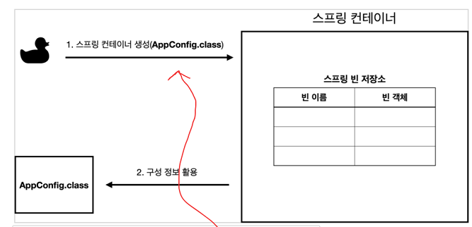
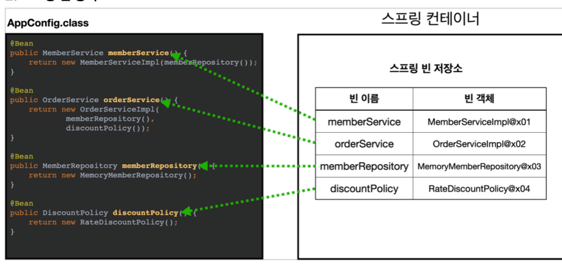
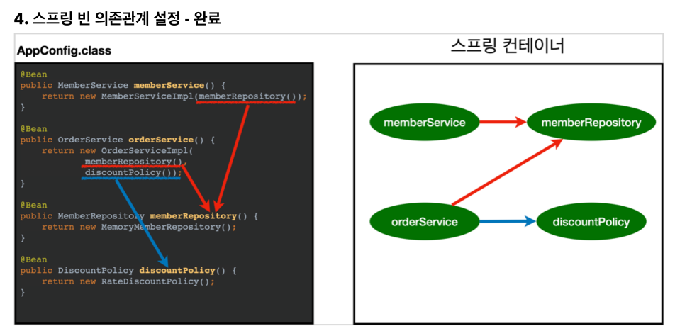

# 2021.11.23
## 스프링 핵심 원리 - 기본편

### 전체 흐름 정리

- 주문 서비스 구현체도 함께 변경해야함 -> DIP 위반   
- 관심사의 분리   
- 공연 기확자, 역활, 배우로 나눔 -> 책임이 명확해짐
- AppConfig
- 사용 영역, 구성 영역으로 분리

### 좋은 객체 지향 설계의 5가지 원칙의 적용

### IOC, DI, 그리고 컨테이너 
본격적으로 스프링에 관련된 내용

- AppConfig 가 IOC 컨테이너이다 또는 DI 컨테이너
- AppConfig 가 의존관계를 주입한다.
- 스프링이 DI 컨테이너 역활을 하는것

### 스프링으로 전환하기

- 기존 스프링이 없는 코드를 스프링으로 전환

스프링 컨테이너에 에 bean 이 등록됨
AppConfig 에 
```JAVA
@Configuration

@Bean
```

스프링컨테이너에서 빈 꺼냄
main 에 
```JAVA
ApplicationContext applicationContext = A
applicationContext.getBean("memberService", MemberService.class);
);
```

### 스프링 컨테이너 생성
스프링 컨테이너가 생성되는 과정 : main 에서 
applicationContext 를 만든다.

이때 AnnotationConfigApplicationContext(AppConfig.class); 를 호출하고 
인자로는 AppConfig.class




AppConfig 에는 내가 빈으로 만들었던 것들이 들어 있다. 스프링 컨테이너가 이걸 이용하여 아래와 같이 만든다


스프링컨테이너가 각 빈들의 의존관계를 설정한다. 어떤 다른 빈들을 호출하는지.. 사용하는지..


### 컨테이너에 등록된 모든 빈 조회

내가 등록한 빈 조회하기 
1. test 에 Beanfind 패키지 생성
2. ApplicationContext

- 모든 빈 조회 : 스프링의 내부에서 사용되는 빈까지 모두 조회된다.   
TEST 에서 작업

```JAVA
@Test
@DisplayName("모든 빈 출력하기")
void findAllBean() {
    String[] beanDefinitionNames = ac.getBeanDefinitionNames();
    for (String beanDefinitionName : beanDefinitionNames) {
        Object bean = ac.getBean(beanDefinitionName);
        System.out.println("name=" + beanDefinitionName + " object=" + bean);
    }
}
```
- 애플리케이션 빈 조회 : ROLE_APPLICATION
```
(beanDefinition.getRole() == BeanDefinition.ROLE_APPLICATION
```

### 스프링 빈 조회
ac.getBean 을 이용하여 빈 조회하는것에 대하여

ac.getBean 의 인자로서 아래와 같이 사용 가능 
- 이름, 타입(인스턴스)
- 타입
- 이름, 타입(구체화 클래스)

실패에 대한 테스트도 해야함.


1. Beanfind 에 ApplicationContextBasicFindTest 클래스 생성
2. 
```java
AnnotationConfigApplicationContext ac = new
AnnotationConfigApplicationContext(AppConfig.class);
```
3. 


```JAVA
@TEST
@DisplayName("빈 이름으로 조회")
void findBeanByName() {
    MemberService memberService = ac.getBean("memberService", MemberService.class); // 인스턴스가 인자
    System.out.println("memberService = " + memberService);
    System.out.println("memberService.getClass() = " + memberService.getClass());
}
```

memberService 의 구현체가 MemberServiceImpl 인지 확인   
<span style="color:red">
MemberServiceImpl.class 와 같이 클래스를 인자로 사용해야함.
</span>
```java
Assertions.assertThat(memberService).isInstanceOf(MemberServiceImpl.class);
```

타입으로만 조회
```java
@Test
@DisplayName("이름없이 타입으로만 조회")
void findBeanByType(){
    MemberService memberService = ac.getBean(MemberServie.class);   
    assertThat(memberService).isInstanceOf(MemberServiceImpl.class);
}
```

```java
    MemberService memberService = ac.getBean(MemberServieImpl.class); // 구현체가 인자
```


실패 테스트
```java
ac.getBean("xxx", MemberService.class);
```
실행시 아래 예외 발생.
```
NoSuchBeanDefinitionException
```


===> 아래와 같이 작성하여 예외가 발생하는지 확인
```java
assertThrows(NoSuchBeanDefinitionException.class, 
    () -> ac.getBean("xxx", MemberService.class));
)
```
의미 :   
() -> ac.getBean("xxx", MemberService.class)  가 실행되면   
NoSuchBeanDefinitionException.class 가 발생해야 된다는 의미

### 스프링 빈 조회 - 동일한 타입이 둘 이상

컨테이너안에 동일한 타입이 둘 이상 있을 때 타입으로 조회하면 에러가 발생하므로
이때는 빈 이름으로 지정해야 한다.


테스트 
1. ApplicationContextSameBeanFindTest 클래스 만든다


2. 테스트를 위해 ApplicationContextSameBeanFindTest 클래스 안에 configuration 을 만든다.
```java
@Configuration
static class SameBeanConfig{
    @Bean
    public MemberRepository memberRepository1() {
        return new MemoryMemberRepository();
    }

    @Bean
    public MemberRepository memberRepository2() {
        return new MemoryMemberRepository();
    }    
}
```

```java
@Test
@DisplayName()
void findBeanByTypeDuplicate(){
    ac.getBeans(MemberRepository.clas);
}
```
이렇게 실행하면 아래와 같은 예외 발생

```
NoUniqueBeanDefinitionException
```

이것을 해결하기 위해서 아래와 같이 찾아야함.    
<span style="color:red">
이름, 타입(인터페이스)
</span>
```java
MemberRepository memberRepository = ac.getBean("memberRepository1", MemberRepository.class);
```

특정 타입을 모두 조회하려면 
```java
Map<String, MemberRepository> beansOfType = ac.getBeansOfType(MemberRepository.class);
for(String key : beansOfType.ketSet()) {
    System.out.println("key = " + key + "value = " + beansOfType.get(key));
}
```
여기서 for 문은 
for(대입받을 변수 정의 : 배열명)
배열명이 beansOfType.ketSet() 이 된다.   

|key|value|
|---|---|
|key1|value1|
|key2|value2|
|key3|value3|

### 스프링 빈 조회 - 상속관계
부모타입을 조회했는데 자식이 여러개 있을때?   
==> 부모타입으로 조회하면 자식들이 다 끌려 나온다.

object 로 조회하면 모든 스프링 빈을 조회한다.

조회 방법 : 
```
- 이름으로 조회
- 이름, 타입으로 죄회
- 특정하위 타입으로 조회
- 부모 타입으로 조회
- 부모 타입으로 모두 조회
```

테스트
1. ApplicationContextExtendsFindTest 클래스를 만든다.

### BeanFactory 와 ApplicationContext


- BeanFactory 와 ApplicationContext 의 상속관계 : ApplicationContext 가 BeanFactory 를 상속
- ApplicationContext 제공하는 부가 기능   
ApplicationContext는 여러 기능을 제공함 - 여러 인터페이스 구현

### 다양한 설정 형식 지원 - 자바코드, xml

### 스프링 빈 설정 메타정보 - BeanDefinition

BeanDefinition 이란??

정리 
1. 스프링은 BeanDefinition으로 스프링 빈 정보를 추상화 한다.

2. 스프링 빈을 만드는 방식은 두가지 방법이 있다   
- 직접등록하는 방법
- 팩토리 매서드를 사용하는 방법   
AppConfig 는 팩토리 매서드를 사용하는 방식이다.
```
factoryBeanName=appConfig
factoryMethodName=orderService
```


테스트
1. BeanDefinitionTest 클래스를 만든다.
```java
public class BeanDefinitionTest {

    AnnotationConfigApplicationContext ac = new AnnotationConfigApplicationContext(Appconfig.class);

    @Test
    @DisplayName("빈 설정 메타정보 확인")
    void findApplicationBean() {
        String[] beanDefinitionNames = ac.getBeanDefinitionNames();
        for(String beanDefinitionName : beanDefinitionNames) {
            BeanDefinition beanDefinition = ac.getBeanDefinition(beanDefinitionName);

            if(beanDefinition.getRole() == BeanDefinition.ROLE_APPLICATION) {
                System.out.println(beanDefinitionName);
                System.out.println(beanDefinition);
            }
        }
    }
}
```

### 웹 어플리케이션과 싱글톤