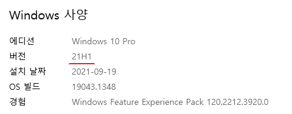
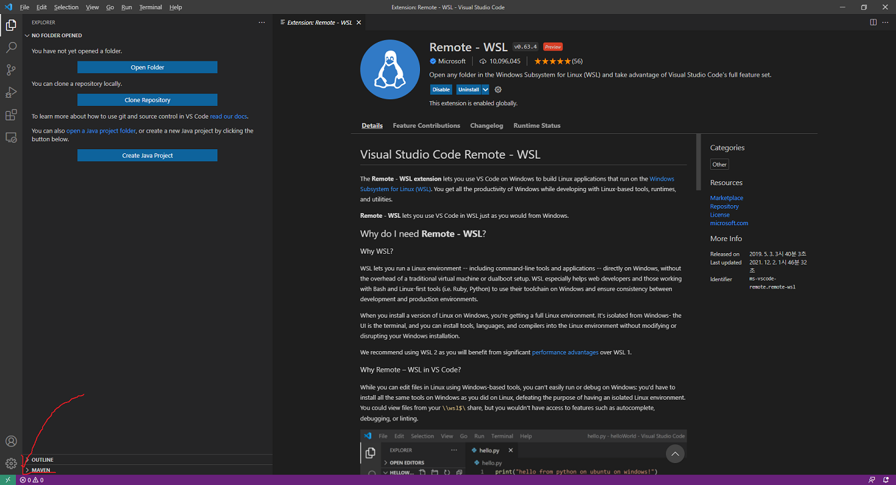
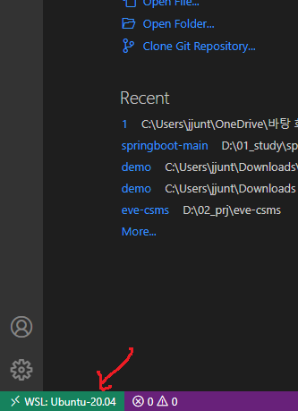
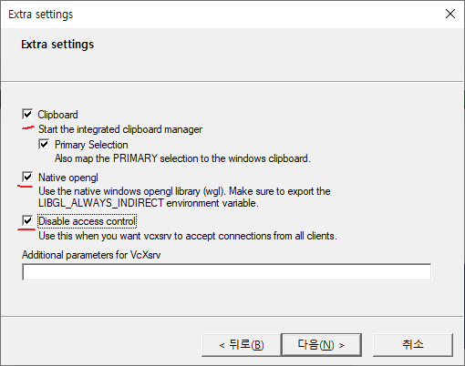
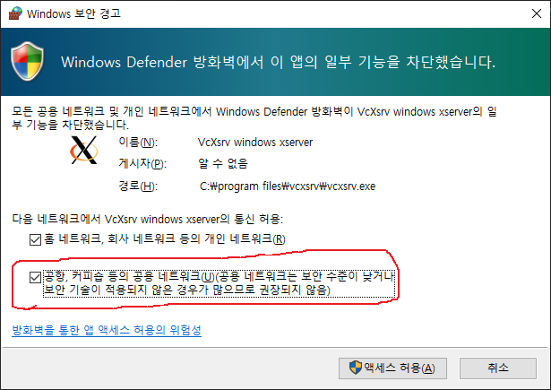
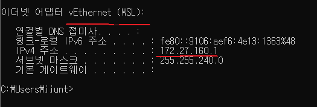

[윈도우10에 WSL 2 설치 해 봤습니다](https://www.youtube.com/watch?v=hwbbFY4Yww0)
1. 윈도우 버전이  2004  이상으로 설치되어 있어야 한다.

2. 스토어에서 ``terminal`` 검색하여 설치
3. [WSL 설치](https://docs.microsoft.com/ko-kr/windows/wsl/install-manual)
4. 
```
dism.exe /online /enable-feature /featurename:Microsoft-Windows-Subsystem-Linux /all /norestart
```
5.   
```
dism.exe /online /enable-feature /featurename:VirtualMachinePlatform /all /norestart
```
6. 재부팅
7. 리눅스 배포판 설치 - Ubuntu 20.04 LTS
8. ```username : pjo```, ```pw : 12345%```
9. wsl 버전 확인
```
wsl -l -v
```
10. ```x64 머신용 최신 WSL2 Linux 커널 업데이트 패키지``` 클릭하여 다운로드 후 설치 
11. 
```wsl --set-version Ubuntu-20.04 2```
12. ```wsl -l -v``` 입력하여 버전확인
13. 우분투 실행
14. 패키지 관리자 업데이트   
``` sudo apt update ```    
15. ~~docker 설치~~   
~~```sudo apt install docker.io```~~
16. VSC 에서 WSL 사용   
extension 에서 ```Remote-WSL```  설치
17. ``` new WSL window ``` 선택

18. WSL 윈도우 실행 확인   


## GUI

~~[](https://www.youtube.com/watch?v=DooJlOPpNTI)~~
[Linux 용 Windows 하위 시스템 2 : VcXsrv X Server 설치](https://www.youtube.com/watch?v=4SZXbl9KVsw)   

1. VcXsrv 다운로드 및 설치
[VcXsrv Windows X Server](https://sourceforge.net/projects/vcxsrv/)
2. Multiple windows, Start no client   

3. 방화벽 설정   

4. ubuntu 실행
5. wsl 의 ip address 얻기   

6. 아래 명령어 입력
```bash
export DISPLAY=172.27.160.1:0.0
export LIBGL_ALWAYS_INDIRECT=1
sudo apt install x11-apps
```
7. 테스트
```bash
xcalc
```

8. 한글 설치   
[[WSL2,한글,Ubuntu] Windows WSL2 설치](https://julialang.kr/?p=3181)
[WSL2에서 한글 입력 사용하기](https://sigmafelix.wordpress.com/2020/08/17/wsl2%EC%97%90%EC%84%9C-%ED%95%9C%EA%B8%80-%EC%9E%85%EB%A0%A5-%EC%82%AC%EC%9A%A9%ED%95%98%EA%B8%B0/)

## IntelliJ   
1. JDK 설치
[우분투(Ubuntu)에서 터미널로 JAVA 설치하기](https://davelogs.tistory.com/71)
```bash
sudo apt-get install openjdk-11-jdk
java -version
```

2.  chrome, intelliJ 설치
[Intellij IDEA with WSL2](https://velog.io/@melonicecream/Intelij-IDEA-with-WSL2)